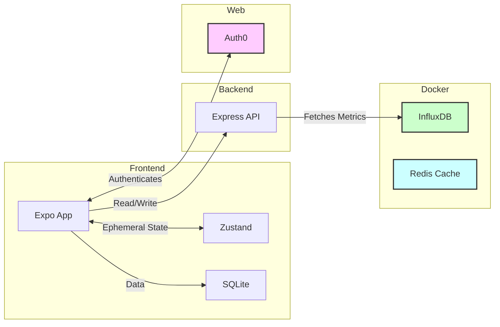
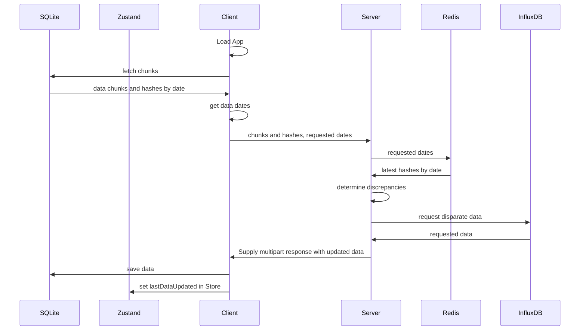

# Design notes

## Running the app (changes)

- `backend`
  1. `docker compose up` (must be run prior to loading data)
  2. `yarn`, warns about data load script
  3. `./scripts/load-data.sh`
- `native-app`
  1. `yarn` runs `expo run prebuild` for managed workflow + dependencies not in Expo Go
  2. `yarn start` 

## Further implementation

- Local db consistency & retrieval
  - See workflow as commented in `app/_layout`
  - Server: update redis on `GET /data`
  - Client: various touchpoints
- Chunked data ranges
  - Adjustable time window on various screens
  - app-wide listener to fetch additional data range
  - see `Data Syncronization Flow` diagram below
- ServerPush/Websockets
  - Kafka-driven events for new data & modified data
- UI enhancements
  - shared values across stylesheets
  - landscape view
  - overall styling
  - loading indicators
  - etc.

## Diagrams

### Architecture (current)

### Data Syncronization Flow

